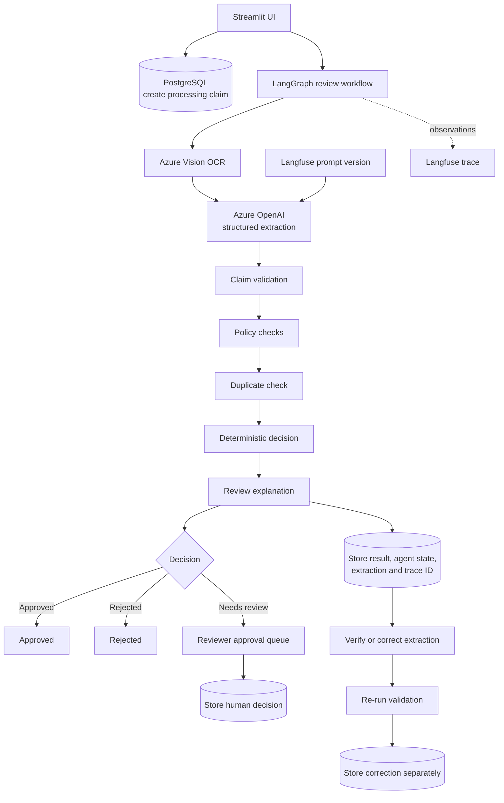
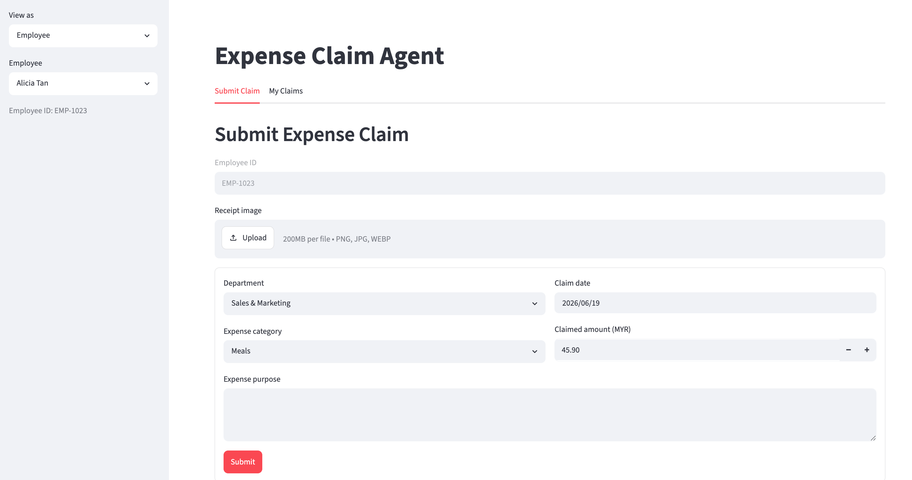
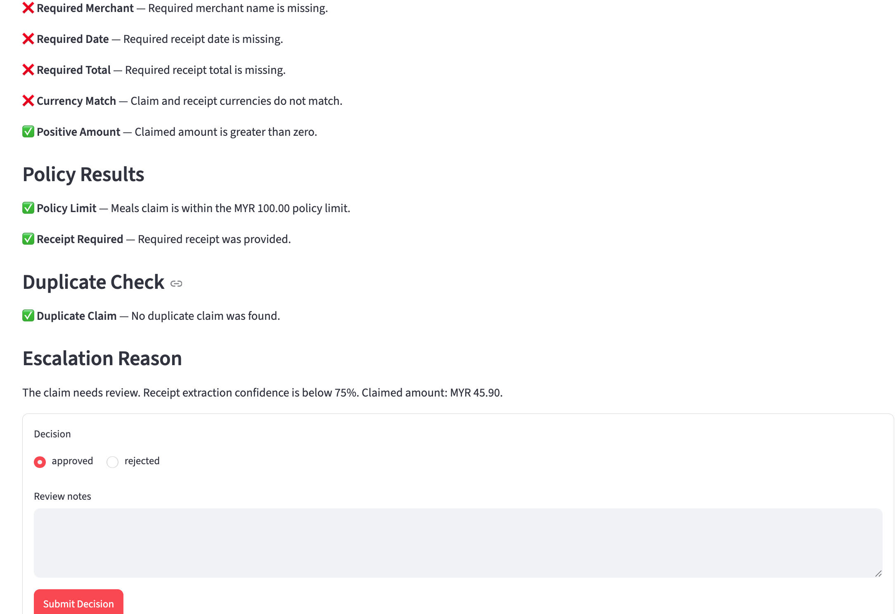
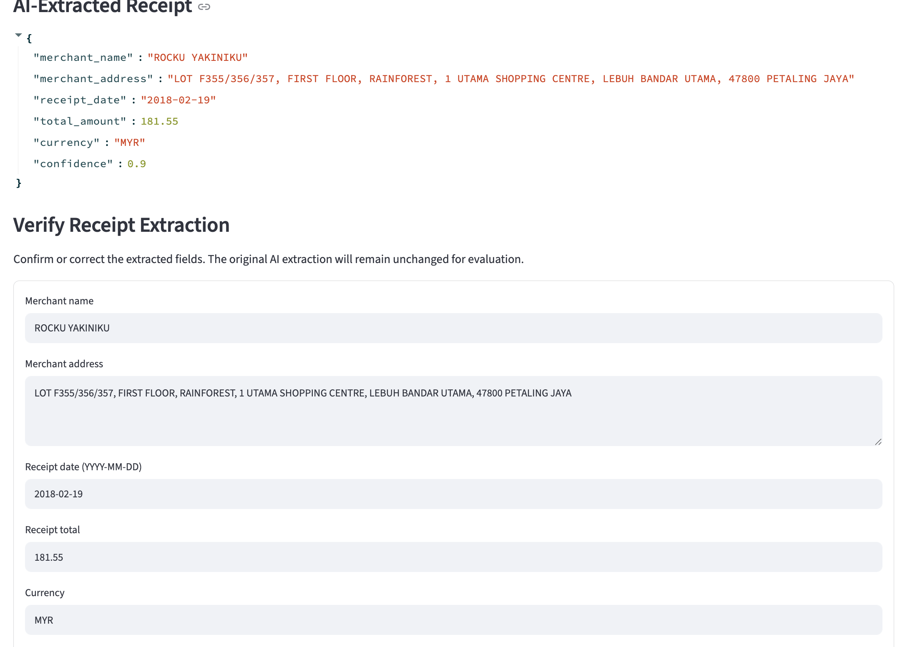
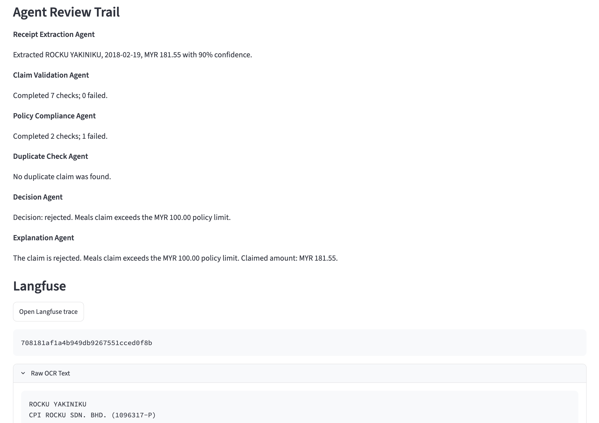
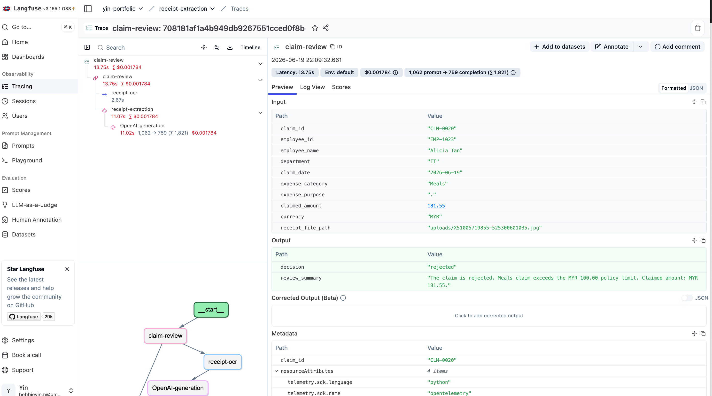

# Expense Claim Agent

An end-to-end AI application that reviews employee expense claims from receipt
images. It combines third party model provider for OCR and LLM extraction, along with deterministic
business rules, human review escalation, and Langfuse audit trail observability.

## What the project demonstrates

- A Streamlit interface for employees and finance reviewers
- Azure Vision OCR for receipt text extraction
- Azure OpenAI to classify text into relevant fields
- LangGraph orchestration for the workflow
- Business decisions like claim validation, policy, duplicate checking
- Langfuse prompt management, tracing, and prompt tuning experiments
- PostgreSQL storage with Alembic migrations
- Human correction and approval flows with an audit trail

## Technical stack

| Area | Tools |
| --- | --- |
| Frontend | Streamlit |
| Backend | PostgreSQL, SQLAlchemy, Alembic |
| AI workflow | LangGraph, Azure Vision, Azure OpenAI |
| Experiment workflow | Langfuse |
| CI/CD & automation | uv, Docker, just, Pytest, Ruff, Bandit|

## Architecture flow



### Review agents

The graph contains six focused steps:

1. **Receipt Extraction** runs OCR and extracts merchant, address, date, total,
   currency, and confidence into a Pydantic schema.
2. **Claim Validation** compares the submitted amount, date, and currency with
   the receipt.
3. **Policy Compliance** applies category limits and receipt requirements.
4. **Duplicate Check** searches earlier claims from the same employee for the
   same merchant, date, and amount.
5. **Decision** returns `approved`, `rejected`, or `needs_review` using explicit
   precedence rules.
6. **Explanation** produces the final review summary and agent trail.


The default `mock` providers allow the workflow and UI to be demonstrated
without making Azure calls.

## Langfuse: prompt tuning and tracing

Langfuse is used for two related purposes.

### Runtime prompt management and tracing

When `LANGFUSE_ENABLED=true`, receipt extraction fetches the
`receipt-key-info-extraction` prompt from Langfuse using the `latest` label.
This allows the prompt to be changed or promoted without changing application
code.

Each claim review records:

- A parent `claim-review` trace
- A `receipt-ocr` span containing OCR input and output
- A `receipt-extraction` generation containing the provider, deployment,
  extracted fields, and model call details
- The final decision and review summary

The Langfuse trace ID is stored with the claim. Reviewers can open the trace
directly from the **Claim Audit Trail** tab.

If Langfuse is disabled, the application uses the local fallback prompt in
`prompts/receipt_extraction.py` and the workflow continues without traces.

### Prompt evaluation

Prompt experiments use frozen OCR results so every prompt version receives the
same input. This separates prompt quality from OCR variability and avoids
repeating Azure OCR calls.

The experiment runner compares extracted fields with ground truth using
per-field and overall:

- Token-overlap F1
- Normalized edit-distance similarity (NED)

This makes prompt tuning measurable: upload a fixed dataset, run two prompt
versions, compare their scores and traces, then promote the better version.
Detailed commands are in
[`experiments/langfuse/README.md`](experiments/langfuse/README.md).

## Dataset

The prompt experiments use the public **Scanned Receipt OCR and Information
Extraction (SROIE)** dataset(https://arxiv.org/abs/2103.10213).

SROIE provides receipt images and labelled fields such as company, address,
date, and total amount.

## Database and correction flow

PostgreSQL stores employees, submitted claims, review status, model output,
human actions, and Langfuse trace IDs.

1. A claim is saved with `processing` status before the AI workflow starts.
2. The completed graph state, original extraction, decision, summary, and trace
   ID are persisted.
3. Claims requiring judgment are marked `pending_review` and shown in the
   reviewer approval queue.
4. A reviewer can approve or reject the claim and add notes.
5. A reviewer can also correct extracted receipt fields and re-run claim
   validation.

The original AI extraction is never overwritten. Corrections and corrected
validation results are stored in separate columns together with the reviewer
and timestamp. This preserves an audit trail and creates useful labelled data
for future extraction evaluation.

Receipt correction currently re-runs validation checks only; it does not
silently replace the original automated decision. Final claim decisions remain
explicit reviewer actions.

## Project structure

```text
app.py                         Streamlit employee and reviewer interface
src/client/                    Langfuse integration
src/database/                  SQLAlchemy entities and operations
src/workflow/agents/           LangGraph workflow and review agents
prompts/                       Local prompt fallback
experiments/langfuse/          SROIE dataset and prompt experiments
migrations/                    Alembic database migrations
tests/                         Workflow, provider, database, and rule tests
```

## Run locally

Install Python 3.12, [`uv`](https://docs.astral.sh/uv/),
[`just`](https://just.systems/), Node.js 20+, and
[`pnpm`](https://pnpm.io/).

```bash
cp .env.example .env
just setup
just db-up
just migrate
just run-ui
```

Open `http://127.0.0.1:8501`.

To run with Docker:

```bash
just deploy-local
```

To run all lint, security, and test checks:

```bash
just check
```

## Screenshots

### Submit Claim



### Human Escalation



### Manual Verification



### Audit Trail



### Langfuse Trace


