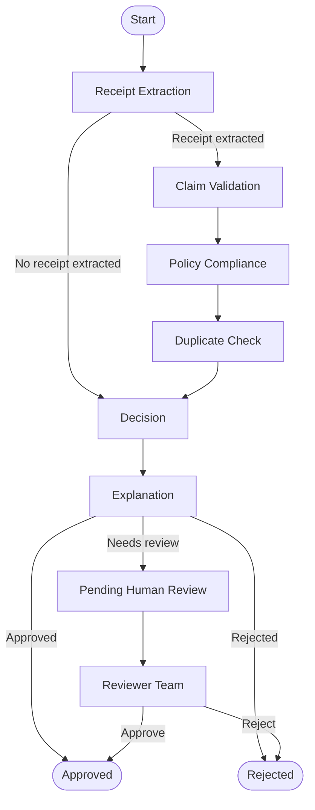

# Expense Claim Agent

## Review workflow

The application uses a LangGraph workflow to process each expense claim:



The workflow consists of six agents:

1. **Receipt Extraction Agent** — Runs OCR to extract text and LLM to assign relevant info.
2. **Claim Validation Agent** — Compares submitted claim details against the
   extracted receipt info.
3. **Policy Compliance Agent** — Checks the claim against company policy
   rules.
4. **Duplicate Check Agent** — Checks previous claims for possible duplicate
   receipts.
5. **Decision Agent** — Determines whether the claim is approved, rejected, or
   needs review.
6. **Explanation Agent** — Generates a concise summary of the review result.

Validation, policy compliance, duplicate checking, decision-making, and
explanation are deterministic workflow steps. Claims marked `needs_review`
are placed in the Reviewer Team approval queue, where a reviewer records the
final approval or rejection and optional review notes.

## Setup

Install Python 3.12, [`uv`](https://docs.astral.sh/uv/),
[`just`](https://just.systems/), Node.js 20+, and
[`pnpm`](https://pnpm.io/), then run:

```bash
cp .env.example .env
just setup
just db-up
just migrate
```

Update `.env` with the required database and provider configuration before
starting the application.

## Prompt configuration

Langfuse prompt management is optional. Set `LANGFUSE_ENABLED=true` to use the
`receipt-key-info-extraction` prompt managed in Langfuse.

If you do not want to set up Langfuse, leave `LANGFUSE_ENABLED=false`. Receipt
extraction will use the local fallback prompt in
`prompts/receipt_extraction.py`.

## Run locally

Start the application:

```bash
just run-ui
```

## Run with Docker

```bash
just deploy-local
```

Stop the Docker services:

```bash
just stop
```
